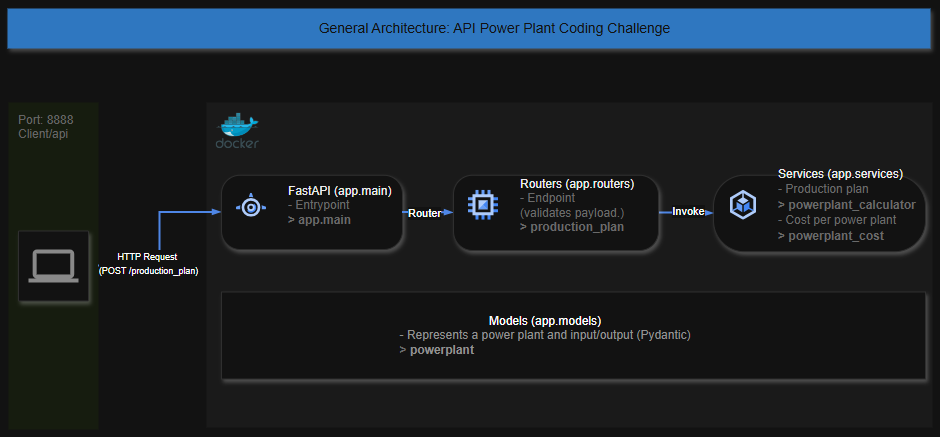
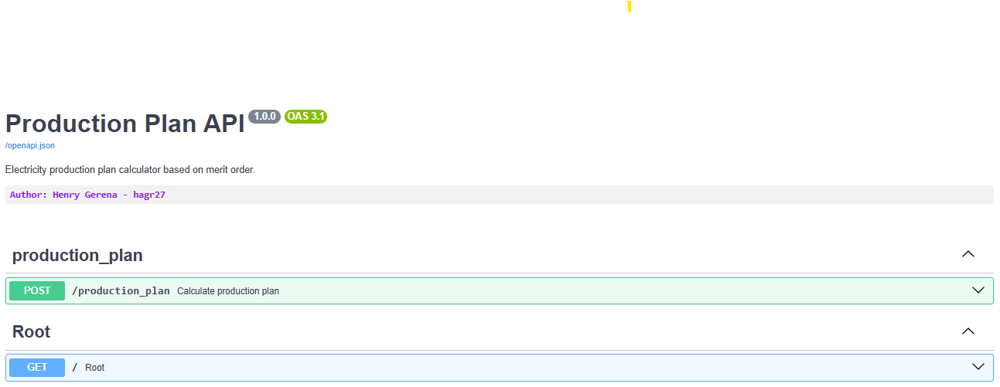
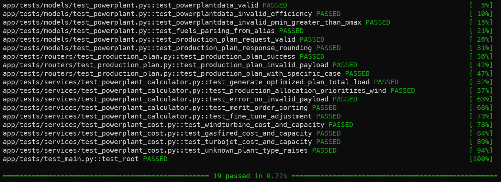

[](https://python.org)
[](https://fastapi.tiangolo.com)
[](https://www.uvicorn.org)
[](https://docs.pydantic.dev)
[](https://www.docker.com)

# **powerplant-coding-challenge**

## About this Repository

This repository provides a solution to the coding challenge described in the official repository:

🔗 [gem-spaas/powerplant-coding-challenge](https://github.com/gem-spaas/powerplant-coding-challenge)

The goal of the challenge is to simulate the calculation of an optimal power production plan, which determines how much power each plant should produce based on a given load. The main factors considered are:

- Fuel costs (e.g., gas, kerosine),
- Minimum (Pmin) and maximum (Pmax) generation capacities of each plant.

# Production Plan API

A RESTful API built with FastAPI that generates optimal electricity production plans using the merit order principle. It considers power demand, fuel costs, and plant constraints (`pmin`, `pmax`) to allocate production efficiently and cost-effectively.

The project follows a layered architecture with clear separation of concerns: API (routers), data validation (Pydantic models), and business logic (services). Core logic is encapsulated in the `ProductionPlanCalculator` service, which applies a step-by-step heuristic based on plant costs. Design patterns like Service and simplified MVC ensure modularity, scalability, and maintainability. While the current implementation handles key constraints well, there’s room for improvement in allocation precision for edge cases.

## Architecture

Below is the proposed architecture designed to address the problem outlined in the API implementation.



## Features

- Compute optimized production plans based on input constraints and fuel prices.
- Supports multiple plant types: `gasfired`, `turbojet`, and `windturbine`.
- Input validation with **Pydantic** models.
- Interactive API documentation via **Swagger UI**.

## Functional Requirements

- The API must accept a POST request with the following input:
  - A required load (in MW) to be distributed among the available power plants.
  - A list of power plants with their characteristics (`name`, `type`, `efficiency`, `pmin`, `pmax`).
  - Current fuel prices (gas, kerosine, CO₂ cost, wind availability).
  
- The system must return a list of power production values per plant such that:
  - The total production equals the required load (within a small tolerance).
  - Each plant respects its individual constraints (`pmin`, `pmax`).
  - The solution is cost-optimal, prioritizing the cheapest plants (merit order).

- The algorithm must be able to:
  - Allocate power to wind turbines with zero cost first.
  - Use gas-fired or turbojet plants based on fuel cost and efficiency.
  - Handle edge cases where the load cannot be covered respecting all constraints.

## Project Structure

The project structure is as follows:

```
powerplant-coding-challenge/
│
├── app/                               # Main application package
│   ├── __init__.py
│   ├── main.py                        # Entry point for the FastAPI app
│   │
│   ├── models/                        # Data models and Pydantic schemas
│   │   ├── powerplant.py              # Power plant data model
│   │   └── __init__.py         
│   │
│   ├── routers/                       # API route definitions
│   │   ├── production_plan.py         # Endpoint for power production calculation
│   │   └── __init__.py
│   │
│   └── services/                      # Business logic and calculations
│       ├── powerplant_cost.py         # Cost calculation logic
│       ├── powerplant_calculator.py   # Power allocation optimization logic
│       └── __init__.py         
│   
├── tests/                             # Unit tests
│   ├── test_main.py                   # test for the root endpoint
│   │
│   ├── models/                        # Data models and Pydantic schemas tests
│   │   └── test_powerplant.py         # Test for PowerPlantData model
│   │
│   ├── routers/                       # API route definitions tests
│   │   └── test_production_plan.py    # Test for production_plan endpoint
│   │
│   └── services/                      # Business logic and calculations tests
│       ├── test_powerplant_cost.py    # Test for powerplant_cost service
│       └── test_powerplant_calculator.py  # Test for powerplant_calculator service
│   
├── example_payloads/       # Sample input/output JSON payloads
│   ├── payload1.json
│   ├── payload2.json
│   ├── payload3.json
│   └── response3.json
│
├── static/                 # Static files (images, CSS, etc.)
│   └── images/
│       ├── architecture.png
│       ├── api.png
│       └── test_api.png
│
├── requirements.txt        # Python dependencies
├── Dockerfile              # Docker image configuration
├── docker-compose.yml      # Docker Compose setup
├── .dockerignore           # Docker ignore file
├── .gitignore              # Git ignore file
├── README_hagr27.md        # Specific documentation for this project
└── README.md               # General description of the coding challenge
```

## Prerequisites

Make sure the following tools are installed on your machine:

- [Python v3.9+](https://www.python.org/downloads/)
- [Pip](https://pip.pypa.io/en/stable/installation/)
- [Docker](https://docs.docker.com/get-docker/)
- [Git](https://git-scm.com/downloads)
- [Curl](https://curl.se/download.html)
- [Postman](https://www.postman.com/downloads/)
- **Python packages**: `fastapi`, `uvicorn`, `pydantic`, `python-dotenv`, `requests`, `pytest`.
> ***Python is only needed if you want to run the project without Docker.***

## Run without Docker
- If you prefer to run the app locally without Docker:
```bash
# Install dependencies
python -m venv venv
source venv/bin/activate
pip install -r requirements.txt

# Start the API
uvicorn app.main:app --reload --port 8888
```	

## Installation & Run with Docker

1. Clone the repository:

```bash
git clone https://github.com/hagr27/powerplant-coding-challenge.git
cd powerplant-coding-challenge

# Checkout the branch for the challenge (feat/production-planning-challenge)
git checkout feat/production-planning-challenge
```

2. Build the Docker containers:

```bash
docker-compose up --build
```

3. Verify the API is running

```bash
curl http://localhost:8888/
```
> - Interactive API documentation (Swagger UI) is available at: [http://localhost:8888/docs](http://localhost:8888/docs)
> 

## Usage

Send a POST request to `/production_plan` with a JSON payload containing::

- `load`: Required power load (MWh).
- `fuels`: Object with fuel prices and wind percentage.
- `powerplants`: List of available plants and their characteristics.

Example payloads can be found in the `example_payloads` directory.

To calculate the production plan, send a POST request to the `/production_plan` endpoint with the JSON payload.

The API will return a JSON response with the name and assigned power for each plant.

## Input

The API accepts a JSON payload with the following fields:

- `load`: Total load in MWh per hour.
- `fuels`: Fuel prices and wind availability.
- `powerplants`: List of power plant data available.

Example payloads can be found in the `example_payloads` directory.

Example Input:

```json
{
  "load": 910,                    # Total load in MWh per hour
  "fuels": {                      # Fuel prices and wind availability
    "gas(euro/MWh)": 13.4,        # Gas price in €/MWh
    "kerosine(euro/MWh)": 50.8,   # Kerosine price in €/MWh
    "co2(euro/ton)": 20,          # CO2 emission price in €/ton
    "wind(%)": 60                 # Wind availability percentage (0-100)
  },
  "powerplants": [                # List of power plant data available
    {
      "name": "gasfiredbig1",     # Name of the powerplant
      "type": "gasfired",         # Type of power plant (gasfired, turbojet, windturbine)
      "efficiency": 0.54,         # Efficiency of the plant
      "pmin": 100,                # Minimum power output in MW
      "pmax": 460                 # Maximum power output in MW
    },
    {
      "name": "tj1",              
      "type": "turbojet",
      "efficiency": 0.3,
      "pmin": 0,
      "pmax": 200
    },
    {
      "name": "windpark1",        
      "type": "windturbine",
      "efficiency": 1,
      "pmin": 0,
      "pmax": 250
    }
  ]
}

```

## Output

The API will return a JSON response with the name and assigned power for each plant. The output will be sorted by cost (lowest to highest) and available power (highest to lowest).

Example output:

```json
[
  {
    "name": "windpark1",
    "p": 250.0
  },
  {
    "name": "gasfiredbig1",
    "p": 460.0
  },
  {
    "name": "tj1",
    "p": 200.0
  }
]
```
## Stop & remove the container

To stop and remove the container, run the following command:
```bash
docker rm -f powerplant_app          # Force removal
docker rmi hagr27/powerplant_app:v1  # Remove image

# Validate that the container and image are no longer present
docker ps -a | grep powerplant_app          # Check if container is still running
docker images | grep hagr27/powerplant_app  # Check if image is still present
```

## Testing

The following section presents the tests conducted using **pytest**.

### Integration Tests

Integration tests are implemented using the **FastAPI** framework. The tests are located in the `tests` directory and are grouped by functionality. For example, the `test_production_plan.py` file contains tests for the `/production_plan` endpoint, which calculates the optimal production plan based on the provided input, you need stay in the root directory of the project `/powerplant-coding-challenge`.

To run the integration tests, execute the following command:

```bash
PYTHONPATH=. pytest -v
```



### Test Coverage

To measure the test coverage of the codebase, the following command can be used:

```bash
pytest --cov=app --cov-report=html
```

This command generates an HTML report that shows the coverage of the codebase. The report can be accessed at `htmlcov/index.html`.    

## License
MIT License

## Author
Developed by [hagr27](https://github.com/hagr27)
